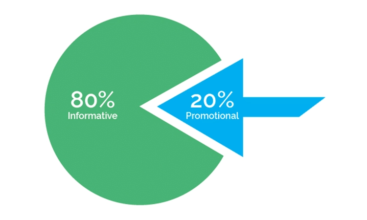
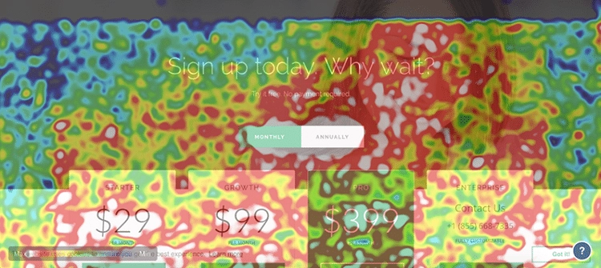
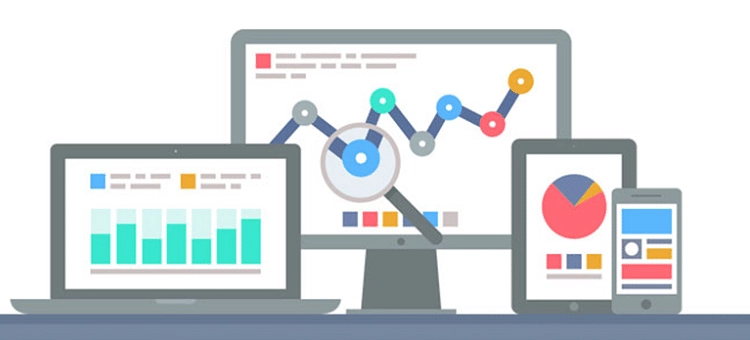
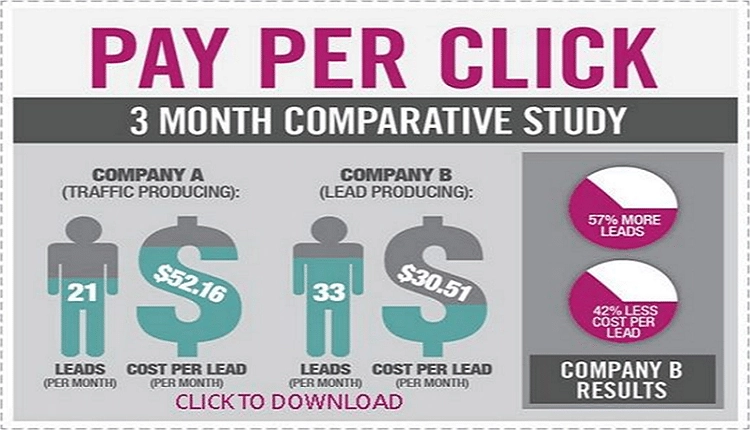
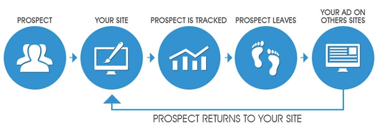

# 电商业务增长指南:8个实战营销策略

---

不管你是刚起步的新手卖家,还是已经摸爬滚打多年的老玩家,有一件事是肯定的:电商这行,技术和玩法更新得比翻书还快。建一个网站容易,但要让它活下来、活得好,那可真不是搭个架子上传点产品图就能搞定的事。

这篇文章不讲虚的,直接聊聊那些真正能帮你提升销量的电商营销策略。没有花哨的理论,都是实打实的方法。

---

## 内容质量:别小看文字的力量

先说个扎心的事实:你的产品页面要是写得跟产品说明书似的,用户看两眼就关了。

好的内容不是堆砌华丽辞藻,而是能让人看懂、看进去、看完还想买的东西。你得把产品的使用场景写出来,把用户可能遇到的问题提前回答了,甚至可以加点小故事、小段子。人们记不住参数,但记得住故事。

内容做好了,不光能吸引新客户,还能让老客户记住你。这年头,谁还没见过几百个同质化的产品页面?真正能打动人的,往往是那些"说人话"的内容。

## 网站布局:别让用户找半天找不到购买按钮

见过那种进去之后不知道该点哪的网站吗?设计得再酷炫,用户找不到下单入口也白搭。

网站布局的核心原则就一个:让用户用起来不费劲。导航清晰、加载快、购物流程简单——这些听起来很基础,但你去看看有多少网站连这些都做不好。

👉 [想知道竞争对手的网站布局为什么比你好用?不妨试试专业的数据采集工具](https://www.scraperapi.com/?fp_ref=coupons)

热力图是个好东西,能告诉你用户在你网站上到底在看什么、点什么。数据会说话,别光凭感觉做决策。

## 社交媒体:你的客户都在刷手机呢

现在还有人一天不碰手机的吗?反正我是没见过。

社交媒体不是用来硬推广告的,是用来"混圈子"的。在小红书、抖音、微博上,用户不想看广告,但他们喜欢看有趣的内容、真实的使用体验、能解决问题的小技巧。你得先成为他们关注的账号,然后才有机会卖东西给他们。

品牌认知这东西,不是砸钱就能砸出来的,得一点一点积累。持续输出有价值的内容,让用户记住你,这比任何广告都管用。

## 邮件营销:别觉得过时,这招还真好使

"邮件营销?现在还有人看邮件?"——别急着否定,数据会打脸的。

邮件营销的转化率其实挺高,尤其是对于那些已经对你品牌有兴趣的人。关键是你别发垃圾邮件,别天天轰炸用户,要发就发点有用的:新品上架、限时折扣、使用技巧、行业资讯……

把用户当朋友,不要当韭菜。定期聊聊天,告诉他们你最近在干什么,有什么新东西,偶尔给点优惠。这种长期的互动,比一次性的促销有效多了。

## 搜索引擎优化:不在第一页,等于不存在

残酷但真实:如果你的网站在搜索结果第二页以后,基本上就没人能找到你。

SEO不是玄学,就是让搜索引擎明白你的网站是干什么的,然后把你推荐给需要的人。关键词要选对,内容要匹配,网站结构要清晰,加载速度要快——这些都是基本功。

多观察竞争对手,看看他们为什么排在前面。分析他们的关键词策略、内容布局、外链情况,这些都是可以学习的地方。

## 付费点击广告:快速但要精准

PPC广告的好处是见效快,投了钱马上就能看到流量。但问题是,如果你不知道怎么玩,钱烧得也快。

广告文案、落地页、关键词——这三个环节必须配合好。用户点了广告进来,结果发现页面内容跟广告说的不一样,那就白花钱了。精准定位你的目标用户,别浪费预算在那些根本不会买的人身上。

## 移动端优化:手机才是主战场

谁还整天抱着电脑购物?手机早就是主流了。

你的网站要是在手机上打开很慢,或者显示乱七八糟,用户根本不会有耐心等。移动端体验差,等于主动把客户推给竞争对手。

除了基本的响应式设计,还可以考虑开发小程序或APP。地理位置定位、推送通知这些功能,能让你更精准地触达用户。

## 再营销:别忘了老客户

一个有意思的现象:很多商家把90%的精力都放在拉新上,却忽略了那些已经买过东西的老客户。

其实,让老客户再次购买,比开发新客户容易得多。他们已经信任你了,只需要一个合适的理由就会回来。定期推送一些专属优惠、新品预告,或者只是问候一下,都能增强用户粘性。

---

## 写在最后

电商这行,没有一劳永逸的秘诀。市场在变,用户在变,你的策略也得跟着变。

这些营销策略不是什么高深莫测的东西,核心就是两点:了解你的用户,然后用他们喜欢的方式跟他们沟通。别想着一口吃成胖子,一步一步来,持续优化,销量自然会上去。

记住,👉 [好的营销工具能让你的策略执行得更顺畅](https://www.scraperapi.com/?fp_ref=coupons),但最终决定成败的,还是你对用户需求的理解和对细节的把控。
